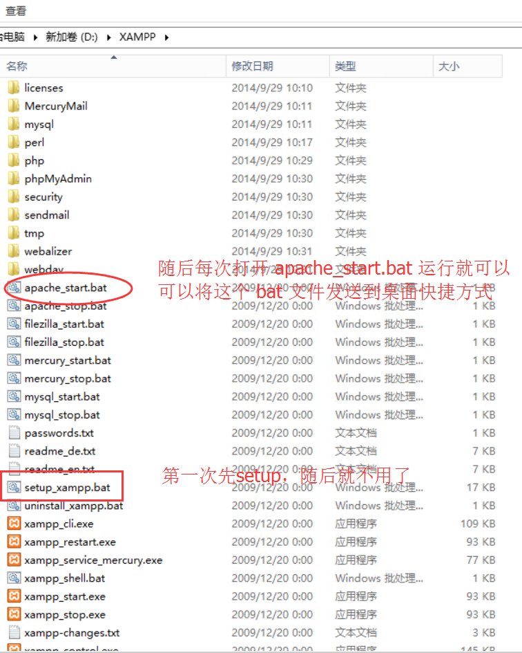

## windows 下安装 Grav - 飞出国

### 安装 xampp ，包含 php 和 apache，并设置 path

首先需要 5.5.9 以上版本 php，飞出国使用 `XAMPP` 最新 7.0 版本，例如 `PHP 7.0.8`，[下载](https://www.apachefriends.org/download.html)后解压安装，然后把 `xampp/php` 目录添加入 环境变量 `PATH` 里，保证可以在任何地方的运行 php 程序。

> 如何在 windows 里设置 PATH 环境变量可以百度。

### 安装 composer

[composer](https://getcomposer.org) 主要是帮助管理 php 包的，方便安装 grav 程序。

下载并安装 [composer](https://getcomposer.org/Composer-Setup.exe)，然后在命令行下测试是否安装成功：

```Bash
  composer -V
```

然后在安装 xampp 的目录下的 `htdocs` 目录下，`shift + 右键`，选择`在此处打开命令窗口`，安装 grav：

```Bash
  $ composer create-project getgrav/grav grav
```

然后运行 `apache_start.bat` 启动 xampp 的 apache，浏览器里打开下面网站查看效果：

http://localhost/grav

如果可以运行，说明 xampp 和 grav 都安装成功，就可以建设新网站了。

## XAMPP 的安装和使用



更多 grav 安装使用的说明文档参考这里： [https://learn.getgrav.org/](https://learn.getgrav.org/) 。
